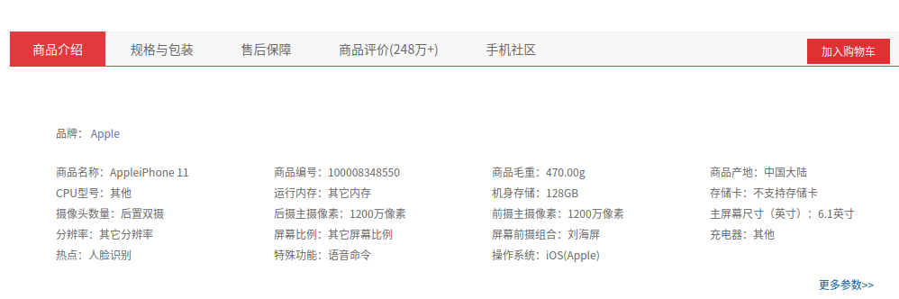

#### １  介绍

使用**springcloud（eureka + gateway + open-feign + hystrix + sleuth + config)** 搭建一个商城微服务项目(后台)

将用到： **docker + nginx + redis + ES + mysql + mybatis-plus +  rocketmq + seata + xxl-job**，欢迎加入 

email:  **Y2hlbmpvZWVAaG90bWFpbC5jb20=**

#### ２　环境准备

**Docker安装 Mysql 5.7**

[MySQL  dockerhub连接](https://hub.docker.com/_/mysql) 

```shell
# 官方连接
docker run  -p 3306:3306 --name mysql57 -e MYSQL_ROOT_PASSWORD=root -d mysql:5.7.30
```


docker TLS handshake timeout.

```
#  修改 /etc/docker/daemon.json,  如果没有就新建一个
{
  "registry-mirrors": ["http://hub-mirror.c.163.com","https://registry.docker-cn.com"]
}
```


#### ３　数据库设计

**3.1 PMS** **商品管理数据库**

**pms_attr**（商品属性）

| id(pk)       | bigint(20)   | 属性id                                           |
| ------------ | ------------ | ------------------------------------------------ |
| attr_name    | char(30)     | 属性名                                           |
| search_type  | tinyint(4)   | 是否需要检索                                     |
| value_type   | tinyint(4)   | 值类型，0单个值，1可以选择多个值                 |
| icon         | varchar(255) | 图标                                             |
| value_select | varchar(255) | 可选值列表                                       |
| attr_type    | tinyint(4)   | 属性类型 0 基本属性(spu)，1 销售属性（sku）      |
| enable       | tinyint(4)   | 启用状态                                         |
| catelog_id   | bigint(20)   | 所属分类（冗余）                                 |
| show_desc    | tinyint(4)   | 快速展示，是否展示在介绍上， 在sku中仍然可以调整 |


**pms_attr_attrgroup_relation** （属性， 属性分组，中间表）

| id(pk)        | bigint20 |      |
| ------------- | -------- | ---- |
| attr_id       | bigint20 |      |
| attr_group_id | bigint20 |      |
| attr_sort     |          |      |


**pms_attr_group**(属性分组)

| id（PK）        | 分组id       |            |
| --------------- | ------------ | ---------- |
| attr_group_name | char(20)     | 组名       |
| sort            | int          | 排序       |
| descript        | varchar(255) | 描述       |
| catelog_id      | bigint(20)   | 所属分类id |


**psm_brand**（品牌）

| id           | bigint20   |        |
| ------------ | ---------- | ------ |
| name         | varchar255 |        |
| logo         | varchar255 |        |
| descript     | varchar255 |        |
| show_status  | tinyint4   |        |
| first_letter | char       | 首字母 |
| sort         | tinyint4   |        |


**psm_category**（商品分类）

| id            | biting20   |          |
| ------------- | ---------- | -------- |
| name          | varchar255 | 分类名称 |
| parent_id     | biting20   | 父 id    |
| cat_level     | tinyint4   | 级别     |
| show_status   | tinyint4   | 是否展示 |
| sort          | tinyint4   | 排序     |
| icon          | varchar255 | 图标地址 |
| product_unit  | char8      | 商品单位 |
| product_count | int20      | 商品总数 |


**pms_spu_attr_value**(spu属性值)

| id         | bigint20   |                                           |
| ---------- | ---------- | ----------------------------------------- |
| spu_id     | bigint20   |                                           |
| attr_id    | bigint20   | 属性 id                                   |
| attr_name  | varchar255 | (冗余） 属性名                            |
| attr_value | varchar255 | 属性值                                    |
| attr_sort  | tinyint4   | 拍下                                      |
| quick_show | tinyint4   | 是否快速展示， 如下图在商品介绍中展示规格 |




**pms_sku_info**（sku信息）

| id              | bigint20   |              |
| --------------- | ---------- | ------------ |
| spu_id          | bigint20   |              |
| sku_code        | varchar20  |              |
| sku_name        | varchar30  | sku名称      |
| sku_desc        | varchar255 | 描述         |
| catelog_id      | bigint20   | 分类id       |
| brand_id        | bigint20   | 品牌id       |
| sku_default_img | tinyint(1) | 默认展示图片 |
| sku_title       | varchar64  | 标题         |
| sku_subtitle    | varchar128 | 子标题       |
| price           | int        | 价格(分)     |
| weight          | int        | 重量         |

**pms_sku_image**（sku图片）

| id          | bigint20   |              |
| ----------- | ---------- | ------------ |
| sku_id      | bigint20   |              |
| img_url     | varchar45  | 图片地址     |
| img_sort    | int20      | 排序         |
| default_img | tinyint(1) | 是否默认图片 |


**pms_sku_attr_value**（sku 销售属性值）

| id         | bigint20     |          |
| ---------- | ------------ | -------- |
| sku_id     | bigint20     |          |
| attr_id    | bigint20     |          |
| attr_name  | varchar(255) | （冗余） |
| attr_value | varchar(255) |          |
| attr_sort  | tinyint4     |          |


**pms_sku_commont**(评论)

**pms_sku_commont_replay**（评论回复）


**pms_spu_images**（spu图片）

| id          | bigint20     |              |
| ----------- | ------------ | ------------ |
| spu_id      | bigint20     | spu id       |
| img_url     | varchar(255) | 图片地址     |
| img_sort    | int11        | 图片排序     |
| default_img | tinyint1     | 是否默认图片 |

**pms_spu_info**（spu信息）

| id            | bigint20   | pk       |
| ------------- | ---------- | -------- |
| spu_name      | varchar256 | 名称     |
| spu_desc      | varchar512 | 描述     |
| catelog_id    | bigint20   | 目录id   |
| brand_id      | bigint20   | 商品id   |
| publish_staus | tinyint4   | 上架状态 |
| create_time   | datetime   | 创建时间 |
| update_time   | datetime   | 更新时间 |

**pms_spu_info_desc**(spu信息介绍)

| spu_id | bigint20 | pk   |
| ------ | -------- | ---- |
| desc   | longtext | 描述 |

